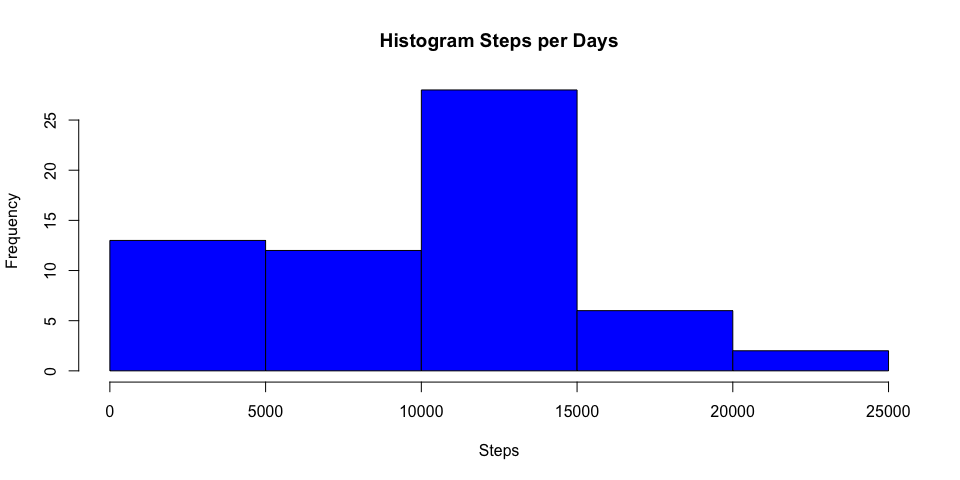
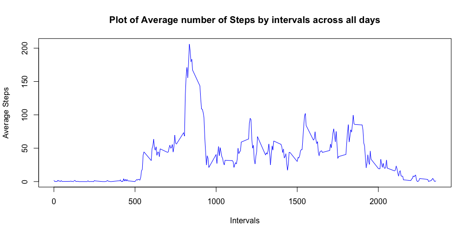
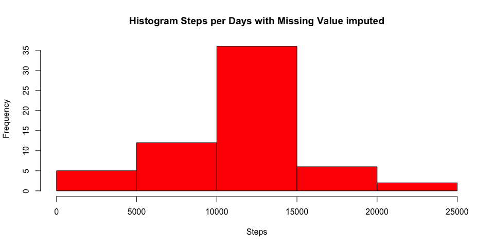
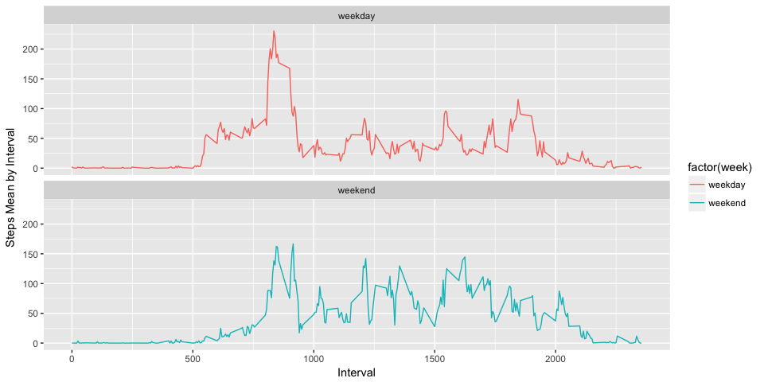

# Reproducible Research: Assignment 1
## Setting R enviroment

```r
knitr::opts_chunk$set(echo = TRUE)
library(dplyr)
```

```
## 
## Attaching package: 'dplyr'
```

```
## The following objects are masked from 'package:stats':
## 
##     filter, lag
```

```
## The following objects are masked from 'package:base':
## 
##     intersect, setdiff, setequal, union
```

```r
library(ggplot2)
```

```
## Warning: package 'ggplot2' was built under R version 3.3.2
```

## Loading and preprocessing the data


```r
fn <- unzip("activity.zip")
act <- read.csv(fn, header = T, sep = ",")
str(act)
```

```
## 'data.frame':	17568 obs. of  3 variables:
##  $ steps   : int  NA NA NA NA NA NA NA NA NA NA ...
##  $ date    : Factor w/ 61 levels "2012-10-01","2012-10-02",..: 1 1 1 1 1 1 1 1 1 1 ...
##  $ interval: int  0 5 10 15 20 25 30 35 40 45 ...
```

## What is mean total number of steps taken per day?

##### 1. Calculate the total number of steps taken per day


```r
actgd <- group_by(act, date)
stepsbd <- summarize(actgd, steps = sum(steps, na.rm = TRUE))
head(stepsbd)
```

```
## # A tibble: 6 × 2
##         date steps
##       <fctr> <int>
## 1 2012-10-01     0
## 2 2012-10-02   126
## 3 2012-10-03 11352
## 4 2012-10-04 12116
## 5 2012-10-05 13294
## 6 2012-10-06 15420
```

##### 2. Histogram of the total number of steps taken each day


```r
with(stepsbd, hist(steps, col = "blue", main ="Histogram Steps per Days",
                   xlab = "Steps"))
```

<!-- -->

##### 3. Mean and median number of steps taken each day


```r
mm <-summarize(stepsbd, steps.mean.per.day = mean(steps, na.rm = TRUE), 
                       steps.median.per.day = median(steps, na.rm = TRUE))
print(mm)
```

```
## # A tibble: 1 × 2
##   steps.mean.per.day steps.median.per.day
##                <dbl>                <int>
## 1            9354.23                10395
```
   
## What is the average daily activity pattern?

##### 1. Make a time series plot of the 5-minute interval (x-axis) and the average number of steps taken, averaged across all days (y-axis)


```r
actgi <- group_by(act, interval)
stepgi <- summarize(actgi, steps.mean.by.intervals = mean(steps, na.rm = TRUE))
with(stepgi, plot(interval, steps.mean.by.intervals, type = "l", 
                  main = "Plot of Average number of Steps by intervals across all days",
                  ylab = "Average Steps", xlab = "Intervals", col = "blue"))
```

<!-- -->

##### 2. Which 5-minute interval, on average across all the days in the dataset, contains the maximum number of steps? 


```r
maxstep <- stepgi[stepgi$steps.mean.by.intervals==max(stepgi$steps.mean.by.intervals),]
print(maxstep)
```

```
## # A tibble: 1 × 2
##   interval steps.mean.by.intervals
##      <int>                   <dbl>
## 1      835                206.1698
```
* The interval 835 is the larger interval of the day with 206 steps  

## Imputing missing values

##### 1. Calculate and report the total number of missing values in the dataset (i.e. the total number of rows with NAs)


```r
vectNA <- is.na(act$steps)
tNA <- sum(vectNA)
print(tNA)
```

```
## [1] 2304
```

##### 2. Devise a strategy for filling in all of the missing values in the dataset. 

 *  As a strategy to imputing missing value, I decide to use the step mean by interval across all days to replace the missing value. 

##### 3. Create a new dataset that is equal to the original dataset but with the missing data filled in.


```r
actfill <- act
for(i in stepgi$interval){
        actfill[actfill$interval == i & vectNA, "steps"] <-
        stepgi[stepgi$interval == i, "steps.mean.by.intervals"]
}
head(actfill)
```

```
##       steps       date interval
## 1 1.7169811 2012-10-01        0
## 2 0.3396226 2012-10-01        5
## 3 0.1320755 2012-10-01       10
## 4 0.1509434 2012-10-01       15
## 5 0.0754717 2012-10-01       20
## 6 2.0943396 2012-10-01       25
```

##### 4. Make a histogram of the total number of steps taken each day and Calculate and report the mean and median total number of steps taken per day. Do these values differ from the estimates from the first part of the assignment? What is the impact of imputing missing data on the estimates of the total daily number of steps?


```r
actfillgd <- group_by(actfill, date)
stepsfillbd <- summarize(actfillgd, steps = sum(steps, na.rm = TRUE))
with(stepsfillbd, hist(steps, col = "red", main ="Histogram Steps per Days with Missing Value imputed", xlab = "Steps"))
```

<!-- -->

##### 5.  Mean and median number of steps taken each day


```r
mmfill <- summarize(stepsfillbd, steps.mean.per.day = mean(steps, na.rm = TRUE), 
                     steps.median.per.day = median(steps, na.rm = TRUE))
print(mmfill)
```

```
## # A tibble: 1 × 2
##   steps.mean.per.day steps.median.per.day
##                <dbl>                <dbl>
## 1           10766.19             10766.19
```
 * The mean and median outcome was really close. This result correspond to  replace all missing value with the step mean by interval across all day.   
 
## Are there differences in activity patterns between weekdays and weekends?

##### 1. Create a new factor variable in the dataset with two levels – “weekday” and “weekend” indicating whether a given date is a weekday or weekend day.


```r
actfill$week <- ifelse(weekdays(as.Date(actfill$date)) %in% c("Saturday", "Sunday"),
                        "weekend", "weekday")
```

##### 2. Make a panel plot containing a time series plot  (i.e. type = "l") of the 5-minute interval (x-axis) and the average number of steps taken, averaged across all weekday days or weekend days (y-axis)


```r
actfill1 <- actfill %>% group_by(week,interval) %>%
        summarize( steps.mean.by.intervals = mean(steps, na.rm = TRUE))
stpint <- ggplot(actfill1,aes(x=interval, y=steps.mean.by.intervals, colour = factor(week))) +
           geom_line() +
           facet_wrap(~week, ncol=1 ) + xlab("Interval") + ylab("Steps Mean by Interval")
print(stpint)
```

<!-- -->
 *  The plot show that the activity began more late during the weekend.  
